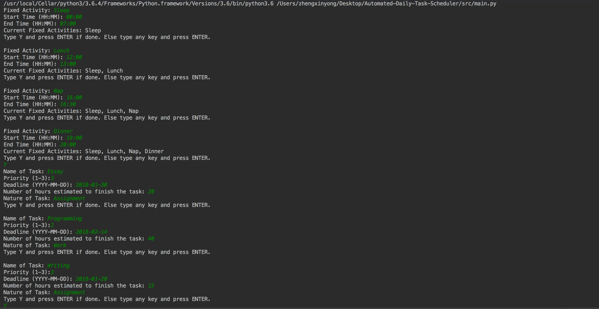
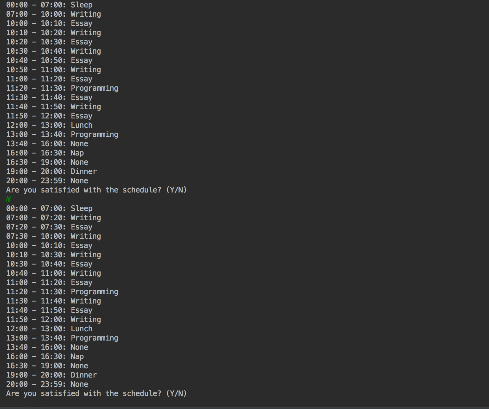

# Automated-Daily-Task-Scheduler

## Motivation
Currently, there is no commercial software, including virtual assistant, in the market that helps a user schedule his/her day.
This Python script is an attempt to the gap of the functions of the virtual assistants.

### How to Use It
Insert The Tasks as Prompted by the Questions:

### Result
Schedule Generated. You can choose to regenerate the schedule if you are unsatisfied with the schedule.

The program will take the feedback and personalize the generated schedule over time based on the user's preferences over the variety of tasks in the schedule, the continuity of a particular task and the spreading out of a task over a few days.

### Behind the Scene
1. Uses multiple local search algorithms (hill climbing and simulated annealing algorithms) to generate the most optimal daily schedule.
2. Uses Artificial Neural Network to personalize the schedule.

### Future Work
1. Fill in the Free slot with activities.
2. Transfer the script to Django Web Application.